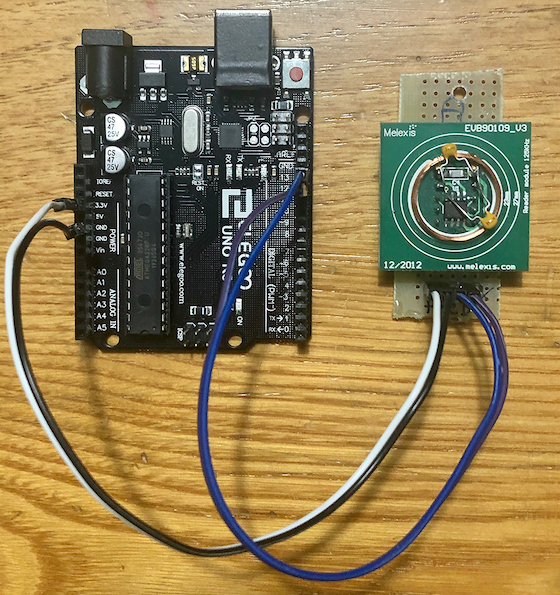

# RFID
RFID library for Arduino with support for 125Khz Melexis MLX90109 tag reader ICs.

For any further reading about MLX90109 see details at https://www.melexis.com/en/product/MLX90109/125kHz-RFID-Transceiver.

For my tests I used the evaluation board EVB90109_V3 with MLX90109 IC.

